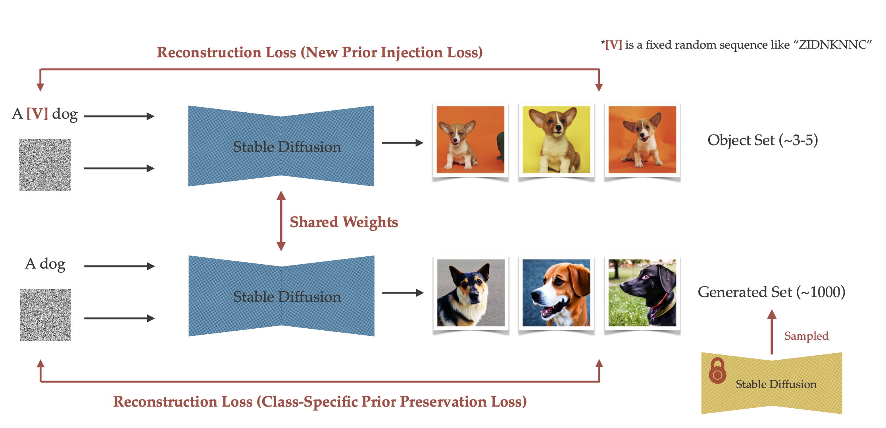
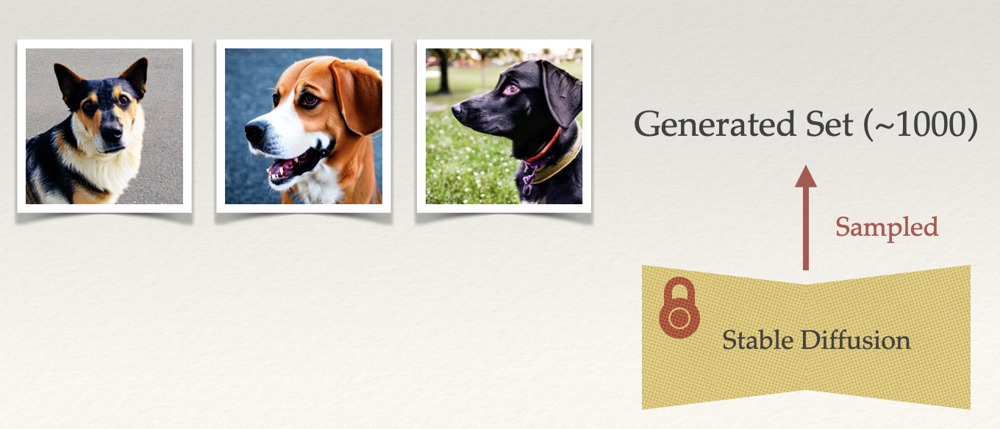

# DreamBooth-Stable-Diffusion

This project is a reimplementation of the [DreamBooth](https://arxiv.org/abs/2208.12242) paper.

This repository is built upon [Stable Diffusion](https://github.com/CompVis/stable-diffusion) usiong Hugging Face's APIs, specifically using their 'diffusers', 'transformers', and 'datasets' libraries.

Please note that this implementation requires a GPU with at least **24GB** of VRAM to run. 

## Usage
### Requirement
```
pip install requirement.txt
```

### Step 1: Data Preparation
1. Put the image you want to customize into `data/img/subject`. (etc. Put 5 cute Corgi images in to `data/img/subject`)

2. Sample a set of images using the prompt structured like 'A [V] [class]' from the ancestral Diffusion model. (etc. sample ~1000 images using the prompt of 'a [V] dog' from the ancestral diffusion model)
```
cd utils
python3 sample_diffusion.py --model_id runwayml/stable-diffusion-v1-5
                            --num_cls 1000
                            --subject corgi
                            --cls dog
```

